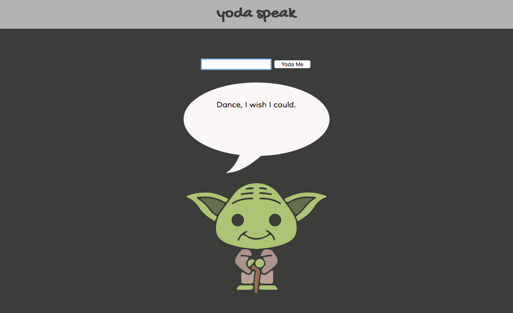
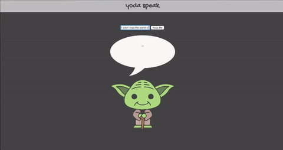

# Yoda-Speak

## Overview
Vanilla JavaScript app where user's input is translated into Yoda-speak, thanks to the Mashape API.

[View the app](https://megancoyle.github.io/yoda/)

## Technologies Used
* JavaScript
* Mashape API

